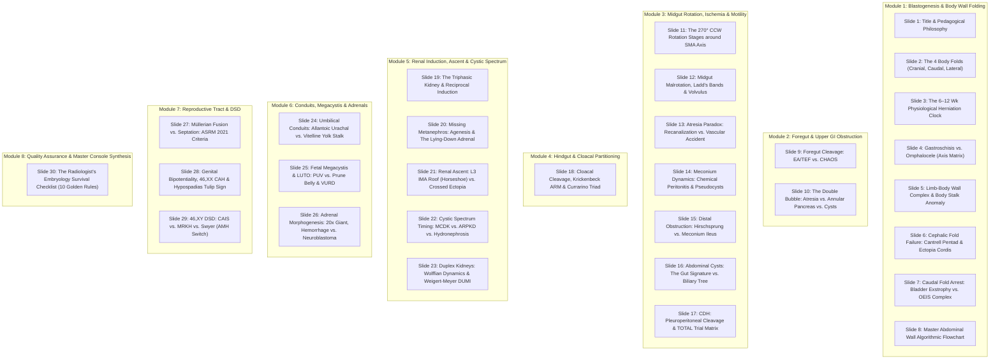

# CLINICAL GIT & GENITOURINARY EMBRYOLOGY FOR RADIOLOGISTS
*Deconstructing Visual Mimics through Embryogenesis: A 30-Slide Algorithmic Masterclass*

**Curated from**: Primary Peer-Reviewed Literature & *Comprehensive Textbook of Clinical Radiology* (Amarnath C., Patel H., Eds.)  
**Faculty / Presenter**: Expert Scientist & Fetal / Pediatric Radiologist  
**Target Audience**: Diagnostic Radiologists, Pediatric Radiologists, Radiology Fellows/Residents, Maternal-Fetal Medicine (MFM) Specialists  
**Core Teaching Philosophy**: **Reverse Embryology** ($\text{Imaging Phenotype} \rightarrow \text{Failed Developmental Checkpoint} \rightarrow \text{Occult Co-anomalies} \rightarrow \text{Perinatal Triage}$)

---

## PRESENTATION ROADMAP & 30-SLIDE SYLLABUS



---

## DETAILED SLIDE-BY-SLIDE CURRICULUM

### Slide 1: Title Slide & Core Philosophy
* **Title:** **Clinical GIT & Genitourinary Embryology for Radiologists: Deconstructing Visual Mimics through Embryogenesis**
* **Subtitle:** An Algorithmic, Mechanism-First Approach to Fetal Abdominal & Pelvic Anomalies
* **Speaker:** Expert Fetal Radiologist & Developmental Embryologist
* **Audience:** Diagnostic Radiologists, Pediatric Radiologists, Maternal-Fetal Medicine Specialists
* **Core Takeaway:** *Visual similarity is a trap. Understanding the exact embryopathic mechanism transforms passive image interpretation into accurate prenatal prognostication and surgical planning.*

---

### Slide 2: Foundational Morphogenesis — The 4 Body Folds
* **Slide Title:** **The Embryological Blueprint: How the 4 Body Folds Construct the Fetal Torso**
* **The 4 Folds (Carnegie Stages 9–12):**
  1. *Cephalic (Cranial) Fold:* Translocates the primitive heart, pericardial cavity, and septum transversum from the cranial disc edge onto the ventral thoracic surface. Arrest leads to Pentalogy of Cantrell and Ectopia Cordis.
  2. *Caudal (Tail) Fold:* Translocates the cloacal membrane and allantois onto the ventral lower abdominal wall. Arrest leads to Cloacal Exstrophy and the OEIS Complex.
  3. *Lateral Somatopleural Folds:* Advance ventrally in the transverse plane, fusing in the midline to convert the endodermal roof into a tubular gut and seal the primary umbilical ring.
* **The 4 Pillars of Reverse Embryology:**
  1. *Timing & Mechanics:* Why an anomaly appears at a specific gestational age.
  2. *Membranes & Relations:* Why umbilical cord insertion differentiates lethal from isolated defects.
  3. *Vascular & Recanalization Dynamics:* Why duodenal atresia carries a 40% Trisomy 21 risk, whereas jejunoileal atresia carries virtually zero aneuploidy risk.
  4. *Inductive Signaling:* Why a single failed ureteric bud produces either an empty fossa, a dysplastic kidney, or crossed ectopia.
* **Radiologist's Pearl:** *Every congenital anomaly is a frozen checkpoint in embryogenesis. When reading fetal scans, do not simply describe the mass—trace which of the 4 body folds or organ buds arrested!*

---

### Slide 3: The Physiological Herniation Clock (6 to 12 Weeks)
* **Slide Title:** **The 270° Journey: Normal Sonoembryology vs. Premature Panic**
* **Embryological Mechanics (CS 16–23):**
  * *Week 6 (8 wks GA):* Midgut elongates rapidly, outpacing embryonic coelom expansion; herniates into the umbilical cord base (extraembryonic coelom).
  * *The Rotation:* First 90° counterclockwise rotation around the Superior Mesenteric Artery (SMA) axis outside the fetal abdomen.
  * *Weeks 10–11 (10–11 wks GA):* Return of midgut loops into the enlarged abdominal cavity, completing another 180° counterclockwise rotation (Total = 270° CCW).
  * *Week 12 (12.0 wks GA):* Cecum settles in RLQ; mesenteric fixation of ascending/descending colons to posterior retroperitoneum.
* **Fetal Sonographic Milestones & Strict Rules:**
  * *Normal Physiologic Omphalocele:* Seen between 8 and 10+6 weeks GA (fetal CRL 20–44 mm); diameter normally $\le 7\text{ mm}$.
  * *Strict Cutoff:* Physiological herniation MUST completely resolve by 12.0 completed weeks GA or CRL > 45 mm!
  * *Pathological Red Flag:* Herniation exceeding >7 mm diameter at any stage, or persisting into the 12–14 week NT scan, demands workup.
  * *Extracorporeal Liver Sign:* If liver tissue is present within the herniation at ANY gestational age, it is NEVER physiological—it is an omphalocele!
* **Radiologist's Pearl:** *Calling an omphalocele at 10 weeks is medical malpractice; missing it at 13 weeks is a diagnostic failure!*

---

### Slide 4: Gastroschisis vs. Omphalocele — The Ventral Wall Divergence
* **Slide Title:** **Gastroschisis vs. Omphalocele: Evisceration vs. Midgut Regression Arrest**

| Diagnostic Axis | **Omphalocele** | **Gastroschisis** |
| :--- | :--- | :--- |
| **Embryological Mechanism** | Failure of rotated midgut loops to return from coelom (weeks 6–10/12) OR lateral body fold closure failure. | Localized full-thickness vascular disruption (right omphalomesenteric artery or right umbilical vein involution) around weeks 4–8. |
| **Defect Location** | **Midline umbilical ring**. | **Right paraumbilical region** (almost exclusively to the right of normal cord). |
| **Covering Sac** | **Present:** 3-layer membrane (inner peritoneum, middle Wharton's jelly, outer amnion). | **Absent:** Free-floating bare bowel directly exposed to amniotic fluid. |
| **Umbilical Cord Insertion** | Inserts **directly onto apex** of herniated sac. | Inserts **normally onto intact abdominal wall** (left of defect). |
| **Herniated Organ Contents** | Small bowel, solid organs (**liver** in >80%, spleen, stomach). | Predominantly small and large bowel loops; solid organs rare. |
| **Associated Anomalies & Genetics** | **High association (>50–88%):** Trisomies 13, 18, 21; Beckwith-Wiedemann, Pentalogy of Cantrell, OEIS. | **Low genetic risk** (usually isolated, normal karyotype); high risk of secondary **bowel atresia, stricture, peritonitis**. |

* **Sonographic & MRI Signatures:**
  * *Omphalocele:* Smooth, hyperechoic sac margin with intra-saccular liver/bowel; umbilical vein entering the mass apex.
  * *Gastroschisis:* Thickened, edematous free bowel loops; serial intra-abdominal bowel dilation >10 mm predicts post-natal bowel complications.
* **Radiology Pearl:** *Tracing the umbilical cord insertion point is the definitive diagnostic step: insertion onto the mass apex proves omphalocele; normal insertion onto intact skin to the left proves gastroschisis.*

---

### Slide 5: Lethal Complex Wall Spectrums — LBWC & Body Stalk Anomaly
* **Slide Title:** **Limb-Body Wall Complex (LBWC) & Body Stalk Anomaly: The Lethal Spectrum**
* **Embryological Mechanics:** Primary failure of germ disc folding during blastogenesis (weeks 3–5), early amnion rupture, or severe vascular disruption leading to persistence of the extraembryonic coelom. The embryo fails to separate from the trophoblast, preventing development of a normal body stalk and umbilical cord.
* **Diagnostic Triad / Criteria (Must meet at least 2 of 3):**
  1. Severe thoraco- and/or abdominoschisis.
  2. Limb defects (clubfoot, oligodactyly, limb amputations/reduction).
  3. Craniofacial defects (exencephaly, encephalocele, facial clefts).
* **Phenotypic Subtypes (Russo Classification):**
  * *Placentocranial Type:* Craniofacial defects, facial clefts, and amniotic cranial adhesions.
  * *Placentoabdominal Type:* Large abdominoschisis, visceral attachment directly to placenta, **absent or rudimentary umbilical cord (<1 cm)**, severe lumbosacral kyphoscoliosis, and internal visceral atresias.
* **Radiology Pearl:** *When an abdominal wall defect is accompanied by severe spinal kyphoscoliosis and an extremely short or non-visualized umbilical cord tethered to the placenta, diagnose Limb-Body Wall Complex / Body Stalk Anomaly. It is universally lethal with zero recurrence risk.*

---

### Slide 6: Cephalic Fold Disruptions — Cantrell Pentad & Ectopia Cordis
* **Slide Title:** **When the Cephalic Fold Fails: Pentalogy of Cantrell & Ectopia Cordis**
* **Embryological Mechanism:** Arrested development of the anterior portion of the septum transversum combined with failure of the paired cephalic lateral mesodermal body folds to fuse in the midline at 3–4 weeks (CS 11–13).
* **The Classical Anatomical Pentad (Cantrell 1958):**
  1. Midline supraumbilical anterior abdominal wall defect (omphalocele-like).
  2. Lower sternal cleft or partial/complete sternal absence.
  3. Anterior diaphragmatic defect (septum transversum deficiency).
  4. Pericardial sac defect with direct pericardio-peritoneal communication.
  5. Intracardiac anomalies (VSD 100%, Tetralogy of Fallot, LV diverticulum) $\pm$ **Ectopia Cordis** (pulsatile heart protruding outside thoracic cage).
* **Radiology Pearl:** *In any fetus with an upper abdominal omphalocele, sweep sagitally into the chest! Check for lower sternal splitting, diaphragmatic discontinuity, and a pulsating heart protruding into the sac.*

---

### Slide 7: Caudal Fold Disruptions — Bladder Exstrophy vs. OEIS Complex
* **Slide Title:** **Caudal Fold Disruptions: Classic Bladder Exstrophy vs. OEIS Complex**
* **Embryological Divergence (Timing of Cloacal Membrane Rupture):**
  * *Late Rupture (after week 7, post urorectal septum descent)* $\rightarrow$ **Classical Bladder Exstrophy:** Anterior bladder wall and pubic ramus dehiscence; normal hindgut; patent anus.
  * *Early Rupture (before week 6, prior to urorectal septum completion)* $\rightarrow$ **Cloacal Exstrophy / OEIS Complex:** Unpartitioned cloaca extrudes lower abdominopelvic viscera.
* **The OEIS Tetrad:**
  * **O:** Omphalocele (infraumbilical).
  * **E:** Exstrophy of the cloaca (everted cecal mucosa flanked by two hemibladders: "elephant trunk" sign).
  * **I:** Imperforate anus (hindgut terminates blindly).
  * **S:** Spinal defects (sacral dysgenesis, hemivertebrae, tethered cord, myelomeningocele).
* **Radiology Pearl:** *Non-visualized bladder + NORMAL amniotic fluid volume = Bladder Exstrophy or OEIS, NOT renal agenesis! The kidneys produce urine normally, which discharges freely into the amniotic fluid through the exstrophic hemibladders.*

---

### Slide 8: Master Abdominal Wall Diagnostic Flowchart
* **Slide Title:** **The Radiologist's Master Flowchart for Fetal Abdominal Wall Defects**

```
                     [ Fetal Abdominal Wall Defect Detected ]
                                        │
           ┌────────────────────────────┴────────────────────────────┐
           ▼                                                         ▼
 [ Umbilical Cord Insertion Point ]                       [ Is Fetal Bladder Visualized? ]
   │                                                         │
   ├─► Inserts on Sac Apex ──► OMPHALOCELE                   ├─► NO ──► Check Infraumbilical Wall & Spine
   │   (Screen Karyotype/Echo; check liver)                  │          ├─► Isolated Infraumbilical Mass ──► BLADDER EXSTROPHY
   │                                                         │          └─► Mass + Omphalocele + Spina Bifida ──► OEIS COMPLEX
   ├─► Inserts Left of Defect ──► GASTROSCHISIS              │
   │   (Naked loops; monitor bowel dilation >10 mm)          └─► YES (Megacystis >7mm) ──► Check Bladder Wall & Urethra
   │                                                                    ├─► Thick Wall + Keyhole Sign ──► PUV
   └─► Absent / Cord Attached to Placenta ──► LBWC                      └─► Thin Wall + Flaccid Muscles ──► PRUNE BELLY SYNDROME
       (Severe scoliosis; universally lethal)
```

---

### Slide 9: Foregut Cleavage — EA/TEF vs. CHAOS
* **Slide Title:** **Foregut Cleavage & Canalization: EA/TEF vs. Laryngeal Atresia (CHAOS)**
* **Embryological Mechanisms:**
  * *EA/TEF:* Weeks 4–5 (CS 10–13). Incomplete fusion of lateral tracheoesophageal ridges due to SHH/NOGGIN downregulation fails to cleave trachea from esophagus.
  * *CHAOS:* Week 10 embryonic. Failure of the laryngeal epithelial plug to recanalize, obstructing the upper airway.
* **Comparative Pathology:**
  * *EA/TEF (Type C 86%):* Polyhydramnios with small/absent stomach bubble. Sagittal T2 MRI displays blind cervical esophageal "upper pouch sign". Coiled feeding tube on neonatal X-ray. VACTERL in 50%.
  * *CHAOS:* Symmetrically massive, diffusely **hyperechoic lungs**; inverted diaphragms; compressed midline heart; ascites/hydrops; fluid-distended trachea.
* **Radiology Pearl:** *A normal stomach bubble on ultrasound DOES NOT rule out Esophageal Atresia! In Gross Type C (86%), swallowed fluid passes through the distal fistula into the stomach.*

---

### Slide 10: Upper GI Obstruction — Deconstructing the "Double Bubble"
* **Slide Title:** **The 'Double Bubble' Deconstructed: Atresia vs. Annular Pancreas vs. Duplication**

```
                 [ Fluid-Filled Stomach ] 
                            │ (Pylorus)
                 [ Dilated Duodenal Bulb ]
                            │
      ┌─────────────────────┼─────────────────────┐
      ▼                     ▼                     ▼
Duodenal Atresia     Annular Pancreas    Enteric Duplication
- Recanalization     - Ventral Bud       - Aberrant Vacuolation
  Failure (Wk 9-11)    Migration Arrest    - Non-Communicating
- Direct Pyloric       - Pancreatic Ring   - 2-Layer "Gut
  Continuity           - Variable Distal     Signature" Wall
- No Distal Gas/Fluid  - Partial Stenosis  - Normal Distal Transit
- 30-40% Trisomy 21
```

* **Differential Imaging Signatures:**
  * *Duodenal Atresia:* Double Bubble with direct fluid continuity across the pylorus; airless distal gut postnatally; 30–40% Trisomy 21.
  * *Annular Pancreas:* Pancreatic tissue encircles D2 ("crocodile-jaw" on MRCP); distal bowel gas may be preserved if stenosis is incomplete.
  * *Duplication Cyst:* Non-communicating RUQ cyst exhibiting the "gut signature" wall; normal distal bowel transit.
* **Radiology Pearl:** *Never diagnose duodenal atresia on ultrasound without demonstrating direct real-time fluid continuity between the left-sided stomach and right-sided duodenal bulb through the pylorus.*

---

### Slide 11: The 270° Midgut Rotation Stages
* **Slide Title:** **The 270° Counterclockwise Ballet: Normal Stages around the SMA Axis**
* **The 3 Stages of Midgut Rotation (Frazer & Robbins):**
  * *Arterial Axis:* Superior Mesenteric Artery (SMA).
  * *Stage 1 (Herniation, Weeks 6–10 GA):* Loops herniate into umbilical cord, rotating 90° counterclockwise (CCW). Pre-arterial DJ loop moves right; post-arterial cecocolic loop moves left.
  * *Stage 2 (Reduction, Weeks 10–12 GA):* Loops return into abdomen, rotating an additional 180° CCW (Total = 270°).
    * DJ loop passes BEHIND SMA to anchor at Ligament of Treitz (L1, left of spine).
    * Cecum passes IN FRONT OF SMA to anchor in RLQ.
  * *Stage 3 (Fixation, Week 12 to Term):* Peritoneal base fuses obliquely across 15–20 cm from LUQ (Treitz) to RLQ (cecum).
* **Radiology Pearl:** *Normal rotation establishes a 15–20 cm broad diagonal mesenteric root that physically prevents the intestine from twisting.*

---

### Slide 12: Midgut Malrotation & Volvulus — Ladd's Bands
* **Slide Title:** **Midgut Malrotation & Volvulus: Ladd's Bands and The Mandatory Lateral View**
* **Pathological Anatomy (Arrest at 180°):**
  * *Cecal Subhepatic Arrest:* Cecum rests high in epigastrium.
  * *Ladd's Peritoneal Bands:* Fibrous bands cross 2nd/3rd duodenum to right parietes, causing extrinsic duodenal compression.
  * *Narrow Mesentery:* Entire midgut hangs on a narrow pedicle centered on SMA/SMV root.
  * *Midgut Volvulus:* Clockwise torsion around SMA -> mesenteric venous thrombosis, arterial occlusion, and total midgut gangrene.
* **Radiological Signs & Pitfalls:**
  * *Upper GI Fluoroscopy (Gold Standard):* DJ junction MUST cross midline to left of pedicle, rise to level of bulb, and DIVE POSTERIORLY INTO RETROPERITONEUM on true lateral view.
  * *Volvulus Sign:* "Corkscrew sign" or beaked duodenal tapering.
  * *Color Doppler:* "Whirlpool sign" (clockwise swirl of SMV around SMA).
* **Radiology Pearl:** *Up to 15–20% of surgically confirmed malrotations have a NORMAL SMA/SMV relationship on Doppler! Never clear an infant with bilious emesis on ultrasound alone—an Upper GI series with true lateral view is mandatory.*

---

### Slide 13: Intestinal Atresia Paradox — Recanalization vs. Vascular Accident
* **Slide Title:** **Intestinal Atresia Paradox: Recanalization Failure vs. Ischemic Catastrophe**
* **The Core Paradox:**
  * *Duodenal Atresia = Tandler's Recanalization Failure (Weeks 7–8):* Endodermal hyperplasia occludes lumen; apoptosis fails to reopen it. High aneuploidy (30–40% Down syndrome); annular pancreas; AVSD. Normal peritoneum.
  * *Jejunoileal Atresia = Late Intrauterine Ischemic Vascular Accident (Weeks 14–28 GA):* Normal 1st trimester recanalization! Late infarction of already-formed gut due to volvulus, intussusception, or thromboembolism (Louw & Barnard). Virtually zero aneuploidy risk; 10% Cystic Fibrosis; Meconium Peritonitis with calcifications.
* **Radiology Pearl:** *Proximal atresia (duodenal) points to a karyotype (Down syndrome); distal atresia (jejunoileal) points to a preventable vascular catastrophe or Cystic Fibrosis.*

---

### Slide 14: Meconium Dynamics — Peritonitis, Pseudocysts & Calcification
* **Slide Title:** **Meconium Dynamics: Chemical Peritonitis, Pseudocysts & Calcification Kinetics**
* **Pathophysiological Cascade:** Antenatal bowel perforation proximal to an atresia or in meconium ileus expels sterile, enzyme-rich meconium and calcium salts into peritoneum $\rightarrow$ intense sterile chemical peritonitis $\rightarrow$ dystrophic calcification within 24–48 hours. Inflammatory adhesions form a thick-walled meconium pseudocyst.
* **Sonographic Triad:**
  1. Peritoneal or scrotal/labial calcifications (hyperechoic foci with acoustic shadowing).
  2. Polyhydramnios.
  3. Fetal ascites $\pm$ thick-walled cystic pseudocyst.
* **Radiology Pearl:** *In male fetuses, always scrutinize the scrotum! Meconium flows down the patent processus vaginalis, forming scrotal calcifications that confirm in-utero bowel perforation.*

---

### Slide 15: Neonatal Distal Obstruction — Hirschsprung vs. Meconium Ileus
* **Slide Title:** **Neonatal Distal Obstruction: Neural Crest Arrest vs. Exocrine Osmotic Failure**
* **Comparative Pathology:**
  * *Hirschsprung Disease:* Arrest of craniocaudal migration of vagal neural crest cells (weeks 5–12; RET mutations). Complete absence of ganglion cells in Meissner and Auerbach plexuses. Aganglionic rectosigmoid remains in permanent spasm. Contrast enema shows rectosigmoid ratio reversal (R/S < 1.0) and cone-shaped transition zone.
  * *Meconium Ileus:* Biallelic CFTR mutations (7q31.2). Dehydrated, tar-like meconium concretions plug the terminal ileum. Colon remains in an unused, diminutive state (Microcolon, "string sign"). Multiple radiolucent pellets in terminal ileum.
  * *Small Left Colon Syndrome:* Functional immaturity in infants of diabetic mothers; caliber change at splenic flexure.
* **Radiology Pearl:** *In 5–10% of Hirschsprung disease, aganglionosis involves the ENTIRE colon, mimicking meconium ileus with a generalized microcolon and NO transition zone! Suction biopsy is essential.*

---

### Slide 16: Foregut & Midgut Cystic Look-Alikes — The "Gut Signature"
* **Slide Title:** **Pediatric Cystic RUQ Masses: The 'Gut Signature' vs. The Biliary Tree**
* **Differential Diagnostic Spectrum:**
  * *Enteric Duplication Cyst:* Vacuolation failure (weeks 4–8). Features smooth muscularis propria coat and true GI mucosa (heterotopic gastric mucosa in 30–50% causes bleeding). Ultrasound shows the pathognomonic **"Gut Signature" (Double-Rim Sign)**: hyperechoic inner mucosa, hypoechoic outer muscularis propria.
  * *Choledochal Cyst (Todani Spectrum):* Anomalous Pancreaticobiliary Junction (APBDJ). Pancreatic enzymes destroy bile duct wall; lacks muscularis propria; communicates with biliary tree; 20–30% lifetime cholangiocarcinoma risk.
  * *Mesenteric Cyst:* Lymphatic sequestration; thin-walled, multilocular, compressible, devoid of muscle.
* **Radiology Pearl:** *In a jaundiced neonate with a porta hepatis cyst, cystic biliary atresia mimics a Todani Type I cyst. Look for an absent/small gallbladder (<1.5 cm) and the 'triangular cord sign' (>4 mm fibrous plaque anterior to portal bifurcation) to diagnose biliary atresia before the 60-day Kasai deadline!*

---

### Slide 17: CDH — Dual-Hit Model & TOTAL Trial Matrix
* **Slide Title:** **Congenital Diaphragmatic Hernia: Dual-Hit Model & TOTAL Trial Matrix**
* **Embryology:** Bochdalek hernia (85% left-sided) arises from pleuroperitoneal fold closure failure before week 10. The **Dual-Hit Model** proves herniation arrests bronchial branching while primary genetic mutations (GATA4, WT1) independently disrupt bilateral pulmonary arteriolar muscularization.
* **TOTAL Trial Stratification (Deprest et al., NEJM 2021):**
  * *Severe CDH:* o/e LHR < 25% (Survival < 15–20% without FETO; ECMO > 80%).
  * *Moderate CDH:* o/e LHR 25–34.9% (liver-up) or 25–44.9% (liver-down).
  * *Mild CDH:* o/e LHR $\ge 45\%$ (Survival > 85%).
  * *Liver Position:* Intrathoracic left hepatic lobe ("Liver-Up") reduces survival by ~40%.
* **Radiology Pearl:** *Right-sided CDH herniates liver and gallbladder, easily misdiagnosed as CPAM Type III or sequestration. Trace portal venous branches or fluid-filled gallbladder into the chest with Doppler!*

---

### Slide 18: Cloacal Cleavage, Krickenbeck ARM & Currarino Triad
* **Slide Title:** **Anorectal Malformations & Currarino Triad: Krickenbeck and MNX1**
* **Embryology & Classification:** Urorectal septum divides cloaca weeks 4–7 into urogenital sinus and anorectal canal. Krickenbeck criteria classify ARMs by specific fistulae (perineal, rectourethral, rectovesical, vestibular, persistent cloaca). Persistent cloaca in females features a single channel with hydrocolpos and calcified enteroliths.
* **Currarino Syndrome (MNX1 / HLXB9 on 7q36):**
  1. Sacral anomaly (**Scimitar sacrum** / hemisacral defect).
  2. Anorectal malformation (anal stenosis, ectopia).
  3. Presacral mass (**Anterior sacral meningocele** in 60%, teratoma, duplication).
* **Radiology Pearl:** *NEVER BIOPSY A PRESACRAL MASS IN CURRARINO SYNDROME! Puncturing an anterior sacral meningocele causes catastrophic bacterial meningitis and CSF fistulae. Always inspect the sacrum on frontal radiographs!*

---

### Slide 19: The Triphasic Kidney & Epithelial-Mesenchymal Induction
* **Slide Title:** **The Triphasic Kidney: Epithelial-Mesenchymal Induction & Nephrogenesis**
* **The Triphasic Timeline:**
  * *Pronephros (Week 4):* Non-functional, regresses.
  * *Mesonephros (Weeks 4–8):* Temporary kidney; gives rise to Wolffian duct.
  * *Metanephros (Week 5+):* Definitive kidney formed by reciprocal dialogue:
    1. *Ureteric Bud (Wolffian outgrowth):* Branches 15–20 times inside blastema to form collecting system (ureter, pelvis, calyces, collecting tubules).
    2. *Metanephric Blastema (Sacral mesoderm):* Undergoes mesenchymal-to-epithelial transition to form excretory nephrons (glomeruli, Bowman's capsules, Loops of Henle, distal tubules).
* **The Golden Morphogenetic Rule:** *NO URETERIC BUD = NO BLASTEMA INDUCTION = RENAL AGENESIS.*

---

### Slide 20: Missing Metanephros — Agenesis & The "Lying-Down" Adrenal
* **Slide Title:** **The Missing Metanephros: Potter Sequence and The 'Lying-Down' Adrenal Sign**
* **Adrenal Autonomy:** Adrenal cortex arises from coelomic mesothelium (week 5); medulla from neural crest (week 7). Adrenals develop completely independently of the metanephros and are present in their normal beds even in bilateral renal agenesis.
* **Mechanical Morphogenesis & Doppler Sweep:**
  * Normally, the ascending kidney molds the soft adrenal into an inverted 'V' or 'Y'.
  * In Renal Agenesis or Ectopia, the adrenal remains flat and discoid: the **"Lying-Down Adrenal Sign"**.
  * Neonatal adrenals are huge (1/3 kidney size) and mimic a normal kidney!
  * Sweep the abdominal aorta with Color Doppler: In agenesis, the main renal artery is completely absent.
* **Radiology Pearl:** *An elongated, flat adrenal in an empty renal bed confirms renal agenesis or ectopia. Confirm absence of the renal artery branching from the aorta.*

---

### Slide 21: Renal Ascent & Rotation — Horseshoe vs. Crossed Ectopia
* **Slide Title:** **Renal Ascent & Rotation: The L3 IMA Roof vs. Crossed-Fused Ureteric Trajectories**
* **Horseshoe Kidney (Arrest at L3):**
  * Lower poles fuse in the pelvis prior to ascent (weeks 4–6).
  * Ascending parenchymal isthmus impinges against the **Inferior Mesenteric Artery (IMA)** branching at L3, permanently halting ascent and medial rotation.
  * Isthmus crosses anterior to aorta/IVC (mimics adenopathy). 6x Wilms tumor risk; increased carcinoid and TCC.
* **Crossed-Fused Renal Ectopia:**
  * Ureteric bud crosses midline to induce contralateral blastema, or blastema is pulled across. 90% fuse with orthotopic kidney.
  * **The Immutable Ureteric Law:** The ectopic kidney's ureter ALWAYS crosses back over midline to insert into its orthotopic ipsilateral bladder trigone!
* **Radiology Pearl:** *The parenchymal isthmus of a horseshoe kidney enhances identically to renal cortex on CT. Remember the 6-fold increased risk of Wilms tumor in pediatric patients!*

---

### Slide 22: Congenital Cystic Spectrum — The Timing Hypothesis
* **Slide Title:** **MCDK vs. ARPKD vs. Hydronephrosis: Connecting Obstruction Timing to Parenchymal Destiny**
* **The Timing Hypothesis:**
  * *Insult < 8–10 Weeks (Early Branching Phase) $\rightarrow$ MCDK:* Complete atresia of early ureteric bud. Blastemal induction aborts; tubules balloon into non-communicating cysts with cartilage metaplasia. 0% split function on Tc-99m DMSA; spontaneous involution in 60%.
  * *Insult > 14 Weeks (Late Functioning Phase) $\rightarrow$ Hydronephrosis / PUJO:* Nephrons already formed! Glomerular filtration against outflow block causes caliceal dilatation with preserved cortical rim.
  * *Ciliopathy $\rightarrow$ ARPKD (PKHD1):* Defective ciliary mechanotransduction dilates 100% of collecting ducts. Massively enlarged hyperechoic kidneys ("salt-and-pepper"); oligohydramnios; Congenital Hepatic Fibrosis in 100%.
* **Radiology Pearl:** *Dilated calyces communicate with a central pelvis in hydronephrosis; cysts do NOT communicate in MCDK. When bilateral enlarged echogenic kidneys are seen, SCAN THE PARENTS to rule out ADPKD!*

---

### Slide 23: Duplex Collecting Systems & Weigert-Meyer Rule
* **Slide Title:** **Duplex Collecting Systems: Wolffian Migration Dynamics & The Weigert-Meyer Rule**
* **The Weigert-Meyer Morphogenetic Law:**
  * Two distinct ureteric buds sprout from Wolffian duct.
  * *Cranial Bud (Lower Pole):* Separates FIRST as Wolffian duct enters bladder base; migrates cranially and laterally $\rightarrow$ inserts **superolaterally** with short intramural tunnel $\rightarrow$ **Vesicoureteral Reflux (VUR)**.
  * *Caudal Bud (Upper Pole):* Separates LATER, dragged caudally and medially $\rightarrow$ inserts **inferomedially (DUMI: Duplex Upper Medial Inferior)**, prone to stenosis or **intravesical ureterocele** $\rightarrow$ **Obstruction & Hydronephrosis**.
* **Radiological Signs:**
  * *"Drooping Lily" Sign:* Dilated, non-opacified upper pole displaces opacified lower pole calyces inferolaterally.
  * *Ureterocele:* Cystic ballooning into bladder lumen ("cobra-head sign").
* **Radiology Pearl:** *In females, ectopic upper pole ureters can insert BELOW the external sphincter (vagina, vestibule), causing continuous non-stop dribbling urinary incontinence despite normal voiding!*

---

### Slide 24: Umbilical Conduits — Urachal vs. Vitelline Remnants
* **Slide Title:** **The Weeping Umbilicus: Allantoic Urachal (Extraperitoneal) vs. Vitelline (Intraperitoneal)**
* **Spatial & Lineage Divergence:**
  * *Urachal Remnants (Allantoic Origin):* Connects bladder dome to umbilicus. Strictly **EXTRAPERITONEAL / PREPERITONEAL** in the prevesical Retzius space. Patent urachus (urine leakage), urachal cyst, sinus, diverticulum. 90% of adult urachal cancers are **Adenocarcinomas** (cloacal mucinous metaplasia).
  * *Vitelline Remnants (Yolk Sac Origin):* Connects midgut to yolk sac. Strictly **INTRAPERITONEAL**, associated with ileum. Patent vitelline duct (fecal discharge), Meckel diverticulum (Rule of 2s; ectopic gastric mucosa), vitelline cyst/band (internal volvulus). Exhibits two-layered "gut signature" wall.
* **Radiology Pearl:** *Never apply silver nitrate to an apparent "umbilical granuloma" without ultrasound! If the lesion is a patent vitelline or urachal stoma, chemical cauterization causes direct bowel perforation or bladder wall necrosis.*

---

### Slide 25: Fetal Megacystis & LUTO — PUV vs. Prune Belly & VURD
* **Slide Title:** **Fetal Megacystis & LUTO: Posterior Urethral Membrane (COP), Prune Belly & VURD**
* **Pathological Mechanics:**
  * *PUV (Mechanical LUTO):* Persistent mesonephric duct membrane at verumontanum (Dewan's COP). Bladder wall is disproportionately thickened, trabeculated, and hypertrophied, with a dilated posterior urethra (**"Keyhole Sign"**).
  * *Prune Belly Syndrome (Eagle-Barrett):* Primary mesodermal dysplasia affecting abdominal wall and urinary smooth muscle. Megacystis is massive, thin-walled, smooth, and flaccid; wildly tortuous ureters; bilateral cryptorchidism; NO keyhole sign.
  * *The VURD Syndrome:* Posterior Urethral Valves, Unilateral Reflux, and Renal Dysplasia. Massive unilateral high-grade VUR acts as an endogenous pop-off pressure valve, sacrificing one kidney to protect contralateral nephrons!
* **Radiology Pearl:** *First-trimester megacystis: longitudinal bladder diameter > 7 mm is abnormal; > 15 mm carries ~100% risk of obstructive uropathy or aneuploidy.*

---

### Slide 26: Adrenal Morphogenesis — Hemorrhage vs. Neuroblastoma
* **Slide Title:** **The Vascularized Giant: Fetal Adrenal Cortex vs. Medullary Neuroblastoma**
* **Embryology & Vascular Trap:** At 20 weeks, the fetal adrenal is 20 times larger relative to body weight than in an adult! 85% is the steroidogenic fetal cortex. It is supplied by 3 suprarenal arteries but drained by a SINGLE central vein. Sudden perinatal hypoxia or stress triggers acute venous congestion and massive hemorrhage.
* **Serial Sonographic Evolution vs. Neuroblastoma:**
  * *Adrenal Hemorrhage:* Avascular on Doppler; rapidly evolves from solid echogenic mass $\rightarrow$ liquefying complex cystic structure $\rightarrow$ rapid shrinkage $\rightarrow$ rim calcifications.
  * *Neuroblastoma:* Persistent solid internal vascularity; stable or growing size; encases vessels; liver metastases ("pepper syndrome").
* **Radiology Pearl:** *Never rush to resect a neonatal suprarenal mass! Perform serial ultrasound at 1, 2, and 4 weeks: a resolving hematoma liquefies, shrinks, and calcifies, while a neuroblastoma persists.*

---

### Slide 27: Müllerian Duct Fusion vs. Septation — ASRM 2021
* **Slide Title:** **Müllerian Duct Anomalies: Lateral Fusion Failure vs. Apoptotic Resorption Failure**
* **Embryological Mechanisms (Weeks 6–12):**
  * *Bicornuate Uterus:* Paramesonephric ducts fail to fuse laterally in the midline (weeks 7–9). Produces two separate uterine horns with TWO SEPARATE external fundal myometrial crowns. ASRM 2021 criteria: External fundal serosal indentation $\ge 1.0\text{ cm}$ (10 mm). Metroplasty strictly contraindicated (causes peritoneal perforation)!
  * *Septate Uterus:* Ducts fuse normally, but midline septum fails to undergo apoptotic resorption (weeks 9–12). Single external fundus (cleft $< 1.0\text{ cm}$). Septum is avascular fibroelastic tissue causing recurrent early ischemic abortions (60–80%). Resected via day-surgery Hysteroscopic Metroplasty (restores term birth to >80%).
* **Radiology Pearl:** *NEVER DIAGNOSE BICORNUATE UTERUS ON HSG ALONE! HSG only opacifies the internal cavity and cannot see the external fundus. Always evaluate external serosa on 3D ultrasound or pelvic MRI.*

---

### Slide 28: Genital Bipotentiality, 46,XX CAH & The Tulip Sign
* **Slide Title:** **The 9-Week Bipotential Divergence: CAH 'Wavy Adrenals' & The Tulip Sign**
* **The 9-Week Cascade:** Up to 9 weeks, external genitalia are indifferent (genital tubercle, urogenital folds, labioscrotal swellings). In males, Testosterone is converted locally by 5$\alpha$-reductase into Dihydrotestosterone (DHT), driving midline fusion of labioscrotal folds and penile urethral closure. In females, absence of DHT leaves folds unfused.
* **Pathological Scenarios:**
  * *46,XX CAH (21-Hydroxylase Deficiency):* Endogenous adrenal androgen excess virilizes female genitalia. ACTH drive produces massive cortical hyperplasia with cerebriform folded cortices on prenatal US (**"Wrinkled / Wavy Adrenal Sign"**).
  * *Hypospadias & The "Tulip Sign":* Incomplete ventral fold fusion leaves a curved, hooded penis bent between bifid scrotal folds, mimicking a tulip flower.
* **Radiology Pearl:** *Ambiguous genitalia combined with bilateral enlarged cerebriform "wavy" adrenals confirms 46,XX CAH—a medical emergency due to impending neonatal salt-wasting adrenal crisis!*

---

### Slide 29: 46,XY DSD & Internal Duct Regression — The AMH Switch
* **Slide Title:** **Disorders of Sex Development: AMH Signaling, Androgen Receptors & Streak Malignancy**
* **Internal Duct Embryology:** Testes secrete Anti-Müllerian Hormone (AMH) to destroy Müllerian ducts, and Testosterone to save Wolffian ducts.
* **The DSD Triad:**
  * *CAIS (46,XY):* AR gene mutation. Testes make AMH and Testosterone. AMH acts $\rightarrow$ Müllerian ducts regress (NO uterus!). Androgen receptors broken $\rightarrow$ Wolffian ducts regress; external genitalia female. Inguinal/abdominal testes present.
  * *MRKH (46,XX):* Müllerian duct agenesis. Absent uterus/upper vagina, but NORMAL FUNCTIONAL OVARIES with follicles.
  * *Swyer Syndrome (46,XY):* SRY mutation. Testes fail to form $\rightarrow$ NO AMH PRODUCED! Without AMH, the Müllerian ducts DO NOT regress $\rightarrow$ 46,XY female with a NORMAL UTERUS and cervix, but bilateral non-functional fibrous streak gonads.
* **Radiology Pearl:** *Streak gonads in Swyer syndrome carry a 25–30% risk of malignant dysgerminoma/gonadoblastoma, mandating prophylactic bilateral gonadectomy! Inguinal hernias in infant girls represent CAIS until proven otherwise.*

---

### Slide 30: The Radiologist's Embryology Survival Checklist
* **Slide Title:** **The Radiologist's Embryology Survival Checklist: 10 Golden Rules**

1. **The 12.0-Week Cutoff:** Never diagnose omphalocele before 12.0 weeks GA (CRL $\le 45\text{ mm}$) unless extracorporeal liver is present; physiological midgut herniation (up to 7 mm) is normal up to 11+6 weeks!
2. **The Skin Bridge Rule:** In gastroschisis, document the intact skin bridge separating the bare defect from the normally inserted cord; in omphalocele, the cord inserts directly onto the sac apex.
3. **The Mandatory Lateral View:** Never clear an infant for malrotation on ultrasound alone. The DJ junction MUST cross the midline AND dive posteriorly into the retroperitoneum on lateral fluoroscopy.
4. **The Pyloric Continuity Test:** Demonstrate direct real-time fluid continuity across the pylorus before diagnosing duodenal atresia (30–40% Trisomy 21).
5. **The OEIS Bladder Paradox:** Non-visualized bladder + normal amniotic fluid volume = Cloacal Exstrophy / OEIS, NOT bilateral renal agenesis!
6. **The Sacral Sickle in ARM:** In every infant with imperforate anus or rectostenosis, check the sacrum for the "scimitar sacrum" (*MNX1* / Currarino triad). Never needle-biopsy a presacral mass!
7. **The Weigert-Meyer "DUMI" Law:** Duplex Upper Medial Inferior: upper pole inserts inferomedially (obstructs/ureterocele); lower pole superolaterally (refluxes). Incontinence in females!
8. **The Adrenal Autonomy Rule:** Adrenals develop independently of kidneys. In an empty renal bed, a flat "lying-down" adrenal confirms agenesis or ectopia. Sweep aorta with Doppler to confirm absent renal artery.
9. **The ASRM Fundal Serosa Rule:** Never diagnose a bicornuate uterus on HSG alone. Fundal serosal cleft $\ge 1.0\text{ cm}$ on 3D US or pelvic MRI = bicornuate; $< 1.0\text{ cm}$ = septate.
10. **The Wavy Adrenal Sign:** Ambiguous genitalia + bilateral cerebriform folded adrenals = 46,XX CAH. Urgent pediatric endocrinology alert for neonatal salt-wasting crisis!

---

## VERIFIED PRIMARY PEER-REVIEWED REFERENCES

1. **Pakdaman R, Woodward PJ, Kennedy A.** Complex abdominal wall defects: appearances at prenatal imaging. *RadioGraphics* 2015;35(2):636–649.
2. **Emanuel PG, Garcia GI, Angtuaco TL.** Prenatal detection of anterior abdominal wall defects with US. *RadioGraphics* 1995;15(3):517–530.
3. **Feldkamp ML, Carey JC, Sadler TW.** The etiology of gastroschisis: a review of the hypotheses. *Am J Med Genet A.* 2007;143A(7):653–663.
4. **Cantrell JR, Haller JA, Ravitch MM.** A syndrome of congenital defects involving the abdominal wall, sternum, diaphragm, pericardium, and heart. *Surg Gynecol Obstet.* 1958;107(5):602–614.
5. **Austin PF, Homsy YL, Gearhart JP, et al.** The prenatal diagnosis of cloacal exstrophy. *J Urol.* 1998;160(3 Pt 2):1179–1181.
6. **Russo R, D'Armiento M, Angrisani P, et al.** Limb body wall complex: a critical review and a nosological proposal. *Am J Med Genet.* 1993;47(6):893–900.
7. **Bradshaw CJ, et al.** Esophageal atresia: prenatal diagnosis and clinical outcome. *Ultrasound Obstet Gynecol.* 2016;47(6):687–693.
8. **Applegate KE.** Evidence-based approach to suspected midgut volvulus in children. *Pediatr Radiol.* 2009;39(Suppl 2):S161–S166.
9. **Pracros JP, et al.** Ultrasound diagnosis of midgut volvulus: the 'whirlpool' sign. *Pediatr Radiol.* 1992;22(1):18–20.
10. **Louw JH, Barnard CN.** Congenital intestinal atresia: observations on its origin. *Lancet.* 1955;269(6898):1065–1067.
11. **Brantberg A, Blaas HG, Salvesen KA, et al.** Fetal duodenal obstructions: increased risk of prenatal sudden death. *Ultrasound Obstet Gynecol.* 2002;20(5):439–446.
12. **Pratap A, et al.** Keys to the diagnosis of Hirschsprung's disease in infants. *Pediatr Surg Int.* 2007;23(4):313–319.
13. **Deprest JA, et al.** Randomized trial of fetal surgery for severe left diaphragmatic hernia (TOTAL trial). *N Engl J Med.* 2021;385(2):107–118.
14. **Macpherson RI.** Gastrointestinal tract duplications: clinical, pathologic, and radiologic features. *RadioGraphics* 1993;13(5):1063–1080.
15. **Holschneider A, et al.** Preliminary summary on the International Conference on the Development of Standards for the Treatment of Anorectal Malformations (Krickenbeck). *J Pediatr Surg.* 2005;40(10):1522–1526.
16. **Currarino G, et al.** Large bowel stenosis or atresia associated with sacrococcygeal teratoma of the presacral space and sacral defect. *Pediatr Radiol.* 1981;10(4):219–223.
17. **Glodny B, et al.** Horseshoe kidney: a review of anatomy, embryology, and clinical implications. *Eur Urol.* 2008;54(4):812–824.
18. **McGahan JP, Nyberg DA.** The 'lying down' adrenal sign: sonographic appearance in renal agenesis and ectopia. *J Clin Ultrasound.* 1989;17(6):429–434.
19. **Guay-Woodford LM.** Autosomal recessive polycystic kidney disease: the prototype of the hepatorenal fibrocystic diseases. *Pediatr Radiol.* 2010;40(1):89–93.
20. **Fernbach SK, Feinstein KA, Spencer K, Lebowitz RL.** The Weigert-Meyer rule: pediatric implications. *AJR Am J Roentgenol.* 1997;169(2):541–546.
21. **Yu JS, Kim KW, Lee HJ, et al.** Urachal anomalies: spectrum of sonographic and CT findings. *RadioGraphics* 2001;21(2):451–461.
22. **Krishnan A, de Souza A, Konijeti R, Baskin LS.** The anatomy and embryology of posterior urethral valves. *J Urol.* 2006;175(4):1214–1220.
23. **Pfeifer SM, Attaran M, Cellek S, et al.** ASRM Mullerian anomalies classification 2021. *Fertil Steril.* 2021;116(5):1238–1252.
24. **Troiano RN, McCarthy SM.** Mullerian duct anomalies: imaging and clinical issues. *Radiology* 2004;233(1):19–32.
25. **Chavhan GB, Parra DA, Oudjhane K, et al.** Imaging of disorders of sexual development. *RadioGraphics* 2008;28(7):1917–1933.
26. **Amarnath C, Patel H, Eds.** *Comprehensive Textbook of Clinical Radiology.*
